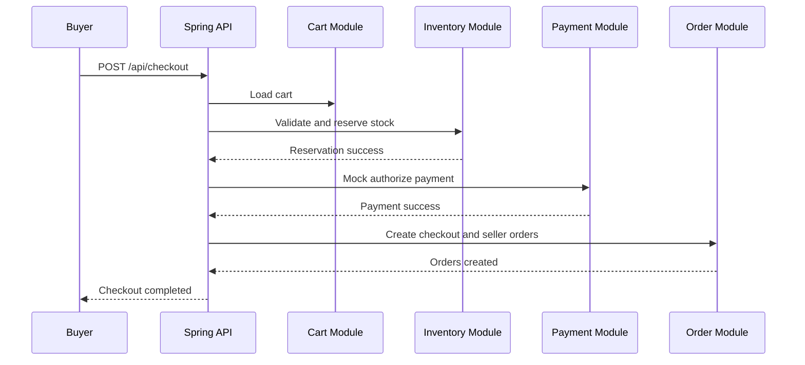

# API Draft

## Identity

- `POST /api/register`
- `POST /api/login`
- `GET /api/me`

## Seller

- `POST /api/seller-profiles`
- `GET /api/seller-profiles/me`
- `PATCH /api/seller-profiles/me`

Detailed: Seller endpoints implemented in Sprint 1.

POST /api/seller-profiles
- Description: Create a seller profile for the authenticated user. A user may have at most one active seller profile.
- Auth: requires authenticated user — this project uses a simple header `X-User-Id` in early development to identify the caller.
- Request body (JSON):

```json
{
    "displayName": "My Store"
}
```

- Responses:
    - `201 Created` — body: created `id` (long). Location header set to `/api/seller-profiles/{id}`.
    - `400 Bad Request` — missing or blank `displayName`.
    - `409 Conflict` — user already has an active seller profile.

GET /api/seller-profiles/me
- Description: (Planned) returns the active seller profile for the authenticated user. Not required for the current vertical slice but included in the API draft.


## Catalog

- `POST /api/products`
- `GET /api/products/{id}`
- `PATCH /api/products/{id}`
- `POST /api/products/{id}/publish`
- `POST /api/products/{id}/variants`
- `PATCH /api/variants/{id}`

Detailed: Catalog endpoints implemented in Sprint 1 (product create, add variant, publish).

POST /api/products
- Description: Create a product draft that belongs to the caller's active seller profile.
- Auth: `X-User-Id` header identifies the user.
 - Request body (JSON):

 ```json
 {
     "title": "Red Widget",
     "description": "A useful red widget"
 }
 ```

- Responses:
    - `201 Created` — body: created product `id`. Location `/api/products/{id}`.
    - `403 Forbidden` — caller has no active seller profile.

POST /api/products/{id}/variants
- Description: Add a product variant and initial inventory record for a product the caller owns.

- Request body (JSON):

```json
{
    "sku": "RW-001",             // optional; if omitted the system will generate one
    "price": 19.99,
    "quantity": 10,
    "options": [                  // optional list of variant options (name/value)
        { "name": "Color", "value": "Red", "sortOrder": 1 }
    ]
}
```

- Validation & business rules:
    - `sku` is optional — when missing the service will generate a SKU using the seller code, product id and option values.
    - SKU must be unique within the seller's catalog (conflict if duplicated).
    - `price` is a decimal; `quantity` is integer initial stock.
    - `options` (optional) can contain up to 3 items; option names must be unique per variant.

- Responses:
    - `201 Created` — body: created variant `id`. Location `/api/products/{id}/variants/{variantId}`.
    - `403 Forbidden` — caller is not the owner of the product.
    - `409 Conflict` — SKU already exists for this seller.

Notes:
- Variant options are persisted in `product_variant_options` and are used to build a human-readable `variantName` (e.g. "Black / Large").
- Inventory is created along with the variant; inventory rules (reservation, commit) are implemented in the domain (`ProductVariantInventory`) and the `ProductVariantInventoryRepository`.

POST /api/products/{id}/publish
- Description: Publish a product so it's visible and purchasable.
- Business rule: A product cannot be published unless it has at least one variant with available inventory (quantity &gt; 0).
- Responses:
    - `200 OK` — product published.
    - `400 Bad Request` — publish rule violated (no in-stock variants).
    - `403 Forbidden` — caller is not the owner of the product.

    Implementation notes:
    - Creating a product now generates and persists a unique slug per seller. The service will create a draft product via `Product.createDraft(...)` and ensure the slug is unique (appending a numeric suffix when needed).
    - The API request/response objects are modelled by records: `CreateProductRequest`, `AddVariantRequest`, and `VariantOptionRequest` in the backend codebase.
    - Errors raised by the service include `ForbiddenOperationException`, `ConflictException`, `BusinessRuleException`, and `ResourceNotFoundException`, which map to appropriate HTTP responses.

Inventory and persistence
- When a variant is added the system creates an `inventory_items` row to track quantity. Inventory rules (reservation, decrement) are implemented later in Sprint 2.


## Inventory

- `POST /api/variants/{id}/inventory-adjustments`
- `GET /api/variants/{id}/inventory`

## Cart

- `GET /api/cart`
- `POST /api/cart/items`
- `PATCH /api/cart/items/{itemId}`
- `DELETE /api/cart/items/{itemId}`

## Checkout and Order

- `POST /api/checkout`
- `GET /api/orders`
- `GET /api/orders/{id}`
- `PATCH /api/orders/{id}/fulfillment-status`

## Payment

- `POST /api/payments/mock-confirm`

## Checkout Flow


