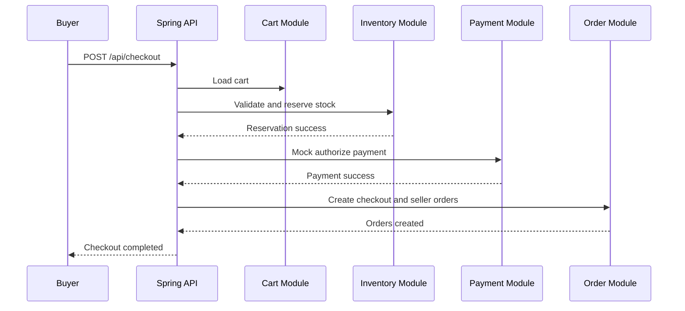

# API Draft

## Identity

- `POST /api/register`
- `POST /api/login`
- `GET /api/me`

## Seller

- `POST /api/seller-profiles`
- `GET /api/seller-profiles/me`
- `PATCH /api/seller-profiles/me`

## Catalog

- `POST /api/products`
- `GET /api/products/{id}`
- `PATCH /api/products/{id}`
- `POST /api/products/{id}/publish`
- `POST /api/products/{id}/variants`
- `PATCH /api/variants/{id}`

## Inventory

- `POST /api/variants/{id}/inventory-adjustments`
- `GET /api/variants/{id}/inventory`

## Cart

- `GET /api/cart`
- `POST /api/cart/items`
- `PATCH /api/cart/items/{itemId}`
- `DELETE /api/cart/items/{itemId}`

## Checkout and Order

- `POST /api/checkout`
- `GET /api/orders`
- `GET /api/orders/{id}`
- `PATCH /api/orders/{id}/fulfillment-status`

## Payment

- `POST /api/payments/mock-confirm`

## Checkout Flow

