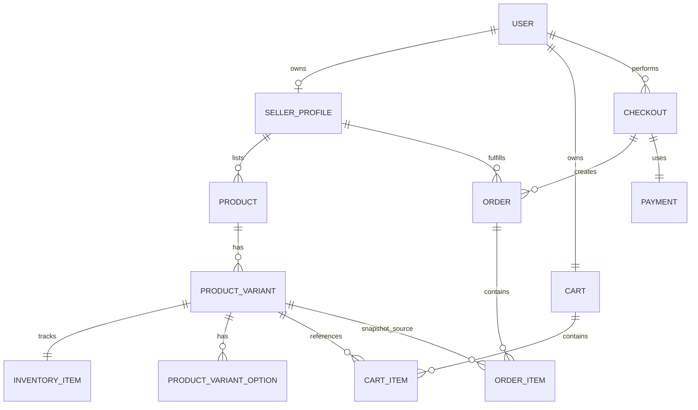

# ERD

## Logical ERD

## Physical Table Direction

First expected tables:

- `users`
- `seller_profiles`
- `products`
- `product_variants`
- `inventory_items`
 - `product_variant_options` (new)
- `carts`
- `cart_items`
- `checkouts`
- `orders`
- `order_items`
- `payments`

## Flyway Plan

Planned initial migration order:

- `V1__create_identity_tables.sql`
- `V2__create_catalog_tables.sql`
- `V3__create_cart_tables.sql`
- `V4__create_order_tables.sql`
- `V5__create_payment_tables.sql`
