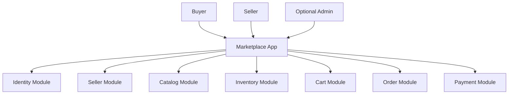
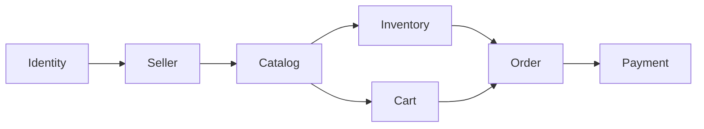
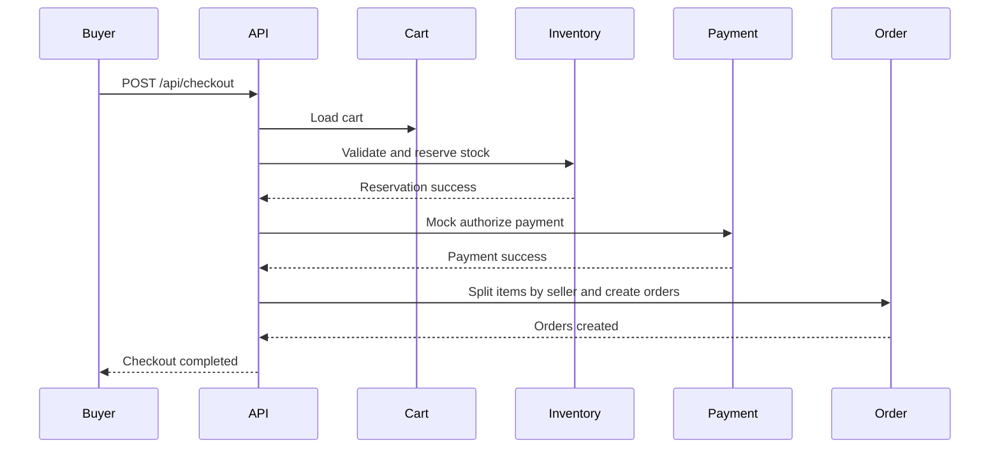
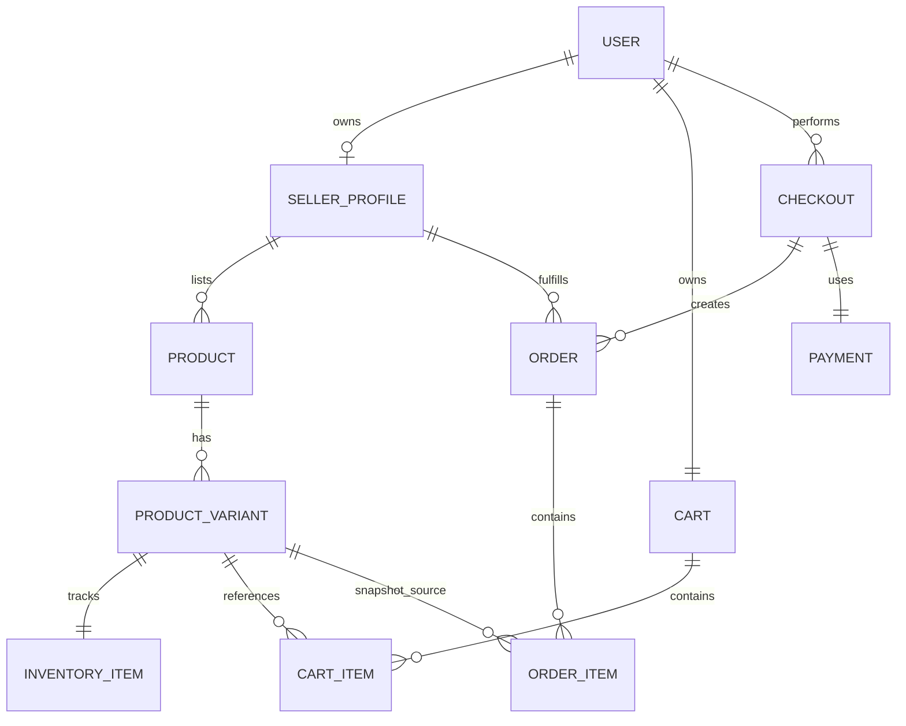
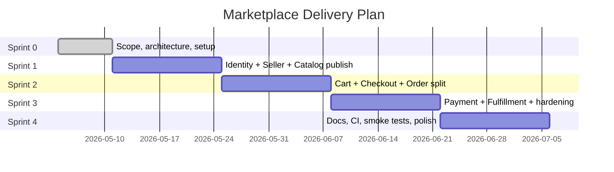
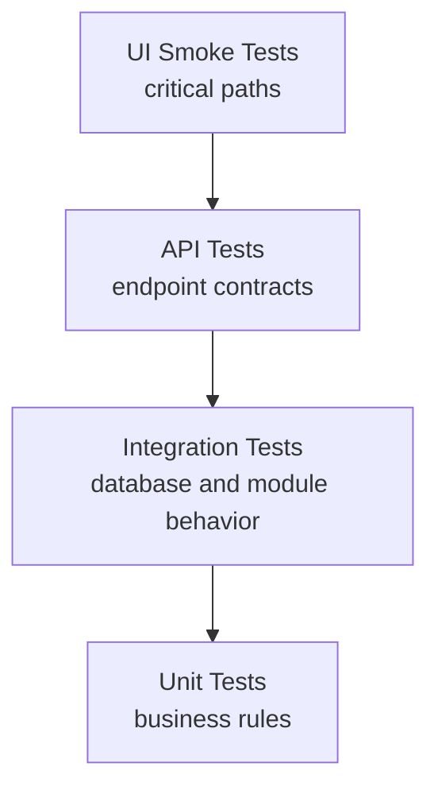

# Marketplace Development Plan

## Product Scope

This project is **a small multi-seller marketplace inspired by Amazon**.

The minimum realistic scope includes:

- Buyer account
- Seller profile
- Product listing
- Variants and inventory
- Cart
- Checkout
- Order splitting by seller
- Mock payment
- Fulfillment status

## Architecture Direction

The project will use a modular monolith.

Key positioning statement:

> I chose a modular monolith to avoid premature microservices while still enforcing domain boundaries.

Mermaid context diagram:



## Technology Stack

Sprint 0 stack decisions:

- Backend: Spring Boot
- Language: Java 21
- Build tool: Maven
- Database: MySQL 8
- Database migrations: Flyway
- Source control and CI platform: GitHub
- Cloud target: AWS or Azure, deferred until later

Guiding principle:

- Keep deployment decisions reversible while the domain model and tests are still evolving.

## Business Rules

Requirements are expressed as business rules.

### Identity

- A user must register with a unique email address.
- A user can act as a buyer without creating a seller profile.
- A user cannot create more than one active seller profile.
- A user must be authenticated to manage a seller profile, products, cart, or checkout.

### Seller

- A seller profile must have a display name before it can be activated.
- A seller profile must belong to exactly one user account.
- Only the owner of a seller profile can create or manage that seller's products.

### Catalog

- A product must belong to exactly one seller profile.
- A product cannot be published unless it has at least one variant with available inventory.
- A published product must have a title, description, base media, and at least one variant.
- A product variant must have a unique SKU within the seller's catalog.
- An unpublished product cannot be added to a buyer cart.

### Inventory

- Inventory is tracked at the product variant level.
- Available inventory cannot drop below zero.
- Inventory must be reserved during checkout before payment is marked successful.
- If checkout fails before order creation completes, any reserved inventory must be released.

### Cart

- A cart belongs to exactly one buyer.
- A cart can contain items from multiple sellers.
- A cart item must reference a specific published product variant.
- A cart item quantity cannot exceed available inventory at validation time.
- Cart pricing is informational only until checkout confirms the final purchasable price.

### Order

- Checkout must snapshot product name, variant, price, and quantity so old orders do not change when products change later.
- A single checkout can produce multiple seller-specific orders.
- Each seller-specific order must contain only items sold by one seller.
- An order cannot be created with zero order items.
- An order status must reflect the payment and fulfillment lifecycle.
- Fulfillment status must be tracked independently per seller-specific order.

### Payment

- Payment is mocked in the first release but must still produce a payment record.
- Payment authorization must happen after inventory validation and before final order confirmation.
- A failed payment must not create confirmed orders.
- A successful payment must be linked to the checkout and resulting seller-specific orders.

## Domain Model

Each module owns its own rules and data boundaries.



### Module Responsibilities

#### Identity

- User registration
- Authentication
- Role or capability checks
- User account lifecycle

Core entities:

- User
- Credential
- Session or token record

#### Seller

- Seller profile creation
- Seller activation
- Seller ownership rules

Core entities:

- SellerProfile

#### Catalog

- Product draft creation
- Product content management
- Product publishing
- Variant definitions

Core entities:

- Product
- ProductVariant
- ProductImage

#### Inventory

- Stock tracking
- Reservation and release
- Availability checks

Core entities:

- InventoryItem
- InventoryReservation

#### Cart

- Cart lifecycle
- Add, update, remove items
- Cart validation before checkout

Core entities:

- Cart
- CartItem

#### Order

- Checkout orchestration
- Order splitting by seller
- Order snapshots
- Fulfillment tracking

Core entities:

- Checkout
- Order
- OrderItem

#### Payment

- Mock payment execution
- Payment result recording
- Payment to order linkage

Core entities:

- Payment
- PaymentTransaction

## API Design

Use cases should become task-oriented endpoints.

### Identity

- `POST /api/register`
- `POST /api/login`
- `GET /api/me`

### Seller

- `POST /api/seller-profiles`
- `GET /api/seller-profiles/me`
- `PATCH /api/seller-profiles/me`

### Catalog

- `POST /api/products`
- `GET /api/products/{id}`
- `PATCH /api/products/{id}`
- `POST /api/products/{id}/publish`
- `POST /api/products/{id}/variants`
- `PATCH /api/variants/{id}`

### Inventory

- `POST /api/variants/{id}/inventory-adjustments`
- `GET /api/variants/{id}/inventory`

### Cart

- `GET /api/cart`
- `POST /api/cart/items`
- `PATCH /api/cart/items/{itemId}`
- `DELETE /api/cart/items/{itemId}`

### Checkout and Order

- `POST /api/checkout`
- `GET /api/orders`
- `GET /api/orders/{id}`
- `PATCH /api/orders/{id}/fulfillment-status`

### Payment

- `POST /api/payments/mock-confirm`

Checkout flow:



## Database Design

Start with a logical ERD, then create physical tables and migrations when the first real schema is ready.

### Logical ERD



### First Physical Tables

Suggested early physical tables:

- `users`
- `seller_profiles`
- `products`
- `product_variants`
- `inventory_items`
- `carts`
- `cart_items`
- `checkouts`
- `orders`
- `order_items`
- `payments`

### Migration Strategy

Use versioned migrations once the initial schema becomes real.

Suggested initial sequence:

- `V1__create_identity_tables.sql`
- `V2__create_catalog_tables.sql`
- `V3__create_cart_tables.sql`
- `V4__create_order_tables.sql`
- `V5__create_payment_tables.sql`

## Vertical Slice Development

Build feature by feature, not layer by layer.

### Slice 1

Register user -> create seller profile -> create product -> publish product

### Slice 2

Buyer adds product to cart -> checkout -> order created

### Slice 3

Seller updates fulfillment status -> buyer views order history

## Sprint Plan

Assume 2-week sprints. If you are working solo, each sprint can be stretched to 3 weeks without changing the sequence.



### Sprint 0: Foundations

Goals:

- Confirm product scope
- Choose stack and repo structure
- Define module boundaries
- Draft logical ERD
- Define initial API contracts
- Set up project skeleton, test structure, and documentation folders

Deliverables:

- Architecture decision log
- Initial business rules document
- Logical ERD in Mermaid
- API draft in Markdown
- Empty module structure in code
- Spring Boot and Maven project skeleton
- MySQL local development setup
- Flyway migration directory structure

Exit criteria:

- Team can explain the module boundaries clearly
- First migrations are ready to start in Sprint 1
- First vertical slice backlog is written

Suggested Sprint 0 repository shape:

```text
backend/
  pom.xml
  src/
    main/
      java/com/quang/marketplace/
      resources/
        application.yml
        db/migration/
    test/
      java/com/quang/marketplace/
docs/
  adr/
  api.md
  business-rules.md
  erd.md
  test-strategy.md
  backlog/
compose.yml
README.md
```

### Sprint 1: Seller Onboarding and Product Publishing

Primary slice:

- Register user -> create seller profile -> create product -> publish product

Stories:

- As a user, I can register and log in
- As a user, I can create my seller profile
- As a seller, I can create a product draft
- As a seller, I can add a variant with inventory
- As a seller, I can publish a valid product

Business rules covered:

- Unique email registration
- One active seller profile per user
- Product cannot publish without a variant with available inventory
- Variant SKU uniqueness within seller scope

Tests:

- Unit tests for seller/profile and publish rules
- Integration tests for identity and catalog persistence
- API tests for register, login, seller profile, product create, product publish

Exit criteria:

- A seller can publish a purchasable product through the API

### Sprint 2: Buyer Cart and Checkout

Primary slice:

- Buyer adds product to cart -> checkout -> order created

Stories:

- As a buyer, I can browse published products
- As a buyer, I can add a product variant to my cart
- As a buyer, I can update quantities in my cart
- As a buyer, I can checkout successfully
- As the system, I split the checkout into seller-specific orders

Business rules covered:

- Only published products can enter cart
- Cart quantity cannot exceed available inventory
- Checkout snapshots product name, variant, price, and quantity
- One checkout can create multiple seller-specific orders

Tests:

- Unit tests for cart validation and order split rules
- Integration tests for reservation, checkout, and snapshot persistence
- API tests for cart endpoints and checkout endpoint

Exit criteria:

- A buyer can checkout a mixed cart and receive seller-specific orders

### Sprint 3: Payment, Fulfillment, and Reliability

Primary slice:

- Mock payment -> confirmed order -> seller fulfillment updates

Stories:

- As the system, I create a payment record for checkout
- As the system, I reject order confirmation on payment failure
- As a seller, I can update fulfillment status for my orders
- As a buyer, I can view my order history and statuses

Business rules covered:

- Failed payment must not create confirmed orders
- Inventory reservations are released on failed checkout
- Fulfillment status is tracked per seller-specific order

Tests:

- Unit tests for payment result transitions
- Integration tests for reservation release and fulfillment updates
- API tests for order queries and fulfillment status endpoints
- Regression tests for price snapshot stability

Exit criteria:

- End-to-end purchase flow works with mock payment and fulfillment tracking

### Sprint 4: CI, Documentation, and Portfolio Hardening

Goals:

- Add meaningful CI checks
- Improve documentation quality
- Add smoke tests if time allows
- Record known limitations and future improvements

Stories:

- As a maintainer, I can validate pull requests automatically
- As a reviewer, I can understand the business rules and architecture quickly
- As a hiring manager, I can see evidence of testing depth and design thinking

Deliverables:

- GitHub Actions pipeline
- Test strategy document
- ERD and architecture docs
- API docs
- Known limitations list
- Future improvements list

Exit criteria:

- Pull requests run automated validation
- Repository is presentation-ready for portfolio review

## Testing Strategy

This area is especially important for a testing engineer portfolio.

### Test Pyramid



### Recommended Coverage

- Unit tests for business rule enforcement
- Integration tests for database mappings, transactions, and module boundaries
- API tests for endpoint behavior and error handling
- UI smoke tests for core happy paths if time allows
- Regression checklist for core marketplace flows

### High-Value Example Tests

- Checkout fails if inventory is unavailable
- Product publish fails without at least one in-stock variant
- Changing product price after purchase does not change old order price
- Checkout splits items from two sellers into two seller-specific orders
- Failed payment releases inventory reservations
- Seller cannot update another seller's fulfillment status

### Regression Checklist

- Register and login still work
- Seller profile creation still works
- Product publish still enforces inventory rule
- Buyer can add published item to cart
- Checkout creates correct seller-specific orders
- Old order snapshots remain unchanged after catalog edits
- Fulfillment status updates are visible to the buyer

## CI Pipeline

Add GitHub Actions once tests are meaningful.

### Pull Request Pipeline

1. Restore dependencies
2. Build backend
3. Run unit tests
4. Run integration tests
5. Build frontend

### Later Enhancements

- Deploy to AWS or Azure
- Run smoke tests against deployed environment
- Publish test reports or coverage summaries

Suggested pipeline flow:


## Documentation Plan

These documents will make the project much stronger as a portfolio piece.

### Recommended Docs

- `docs/business-rules.md`
- `docs/marketplace-development-plan.md`
- `docs/erd.md`
- `docs/api.md`
- `docs/test-strategy.md`
- `docs/known-limitations.md`
- `docs/future-improvements.md`
- `docs/adr/0001-modular-monolith.md`

### Architecture Decision Log

Keep ADRs short and practical:

- Context
- Decision
- Consequences
- Alternatives considered

## Known Limitations for Early Versions

- Mock payment only
- No shipping fee calculation
- No promotions or coupons
- No seller payout workflow
- No product reviews
- No admin moderation tools
- Limited concurrency handling compared with production marketplaces

## Future Improvements

- Real payment gateway integration
- Reservation expiration jobs
- Search and filtering
- Product reviews and ratings
- Seller dashboards and analytics
- Shipment tracking
- Promotions and discount rules
- Admin moderation and reporting
- Event-driven integration points for future service extraction

## Suggested Next Build Order

1. Create the documentation skeleton under `docs/`
2. Create module folders for `Identity`, `Seller`, `Catalog`, `Inventory`, `Cart`, `Order`, and `Payment`
3. Implement Sprint 1 vertical slice end to end
4. Add tests alongside each slice
5. Introduce CI after Sprint 2 or when tests become meaningful
