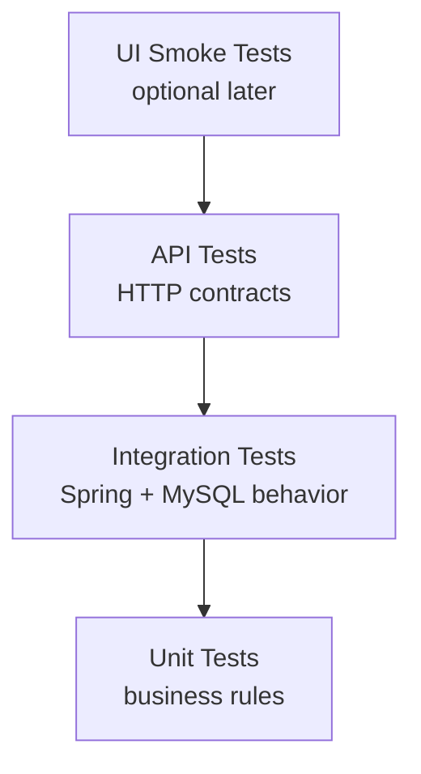

# Test Strategy

## Goal

Use testing to prove business-rule correctness, database behavior, and API reliability.

## Test Layers

## Planned Tooling Direction

- JUnit 5 for unit and integration tests
- Spring Boot Test for application-level tests
- Testcontainers for MySQL-backed integration tests
- MockMvc or RestAssured for API tests
- GitHub Actions for pull request validation

## High-Value Tests

- Checkout fails if inventory is unavailable
- Product publish fails without at least one in-stock variant
- Changing product price after purchase does not change old order price
- Checkout splits items from multiple sellers into seller-specific orders
- Failed payment releases inventory reservations
- Seller cannot update another seller's fulfillment status

## Regression Checklist

- Register and login still work
- Seller profile creation still works
- Product publish still enforces inventory rule
- Buyer can add published item to cart
- Checkout creates correct seller-specific orders
- Old order snapshots remain unchanged after catalog edits
- Fulfillment status updates are visible to the buyer
