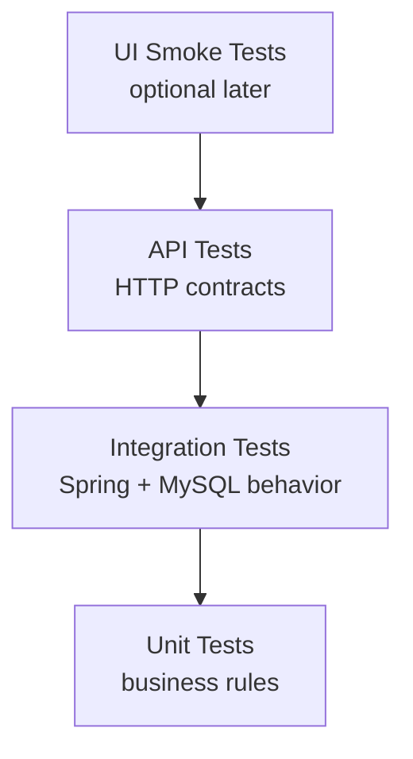

# Test Strategy

## Goal

Use testing to prove business-rule correctness, database behavior, and API reliability.

## Test Layers



## Planned Tooling Direction

- JUnit 5 for unit and integration tests
- Spring Boot Test for application-level tests
- Testcontainers for MySQL-backed integration tests
- MockMvc or RestAssured for API tests
- GitHub Actions for pull request validation

## Local test environment / Testcontainers notes

- Integration tests use Testcontainers with a MySQL container to provide high-fidelity verification of migrations, SQL, and JDBC behavior.
- Testcontainers requires a working Docker daemon accessible from the JVM running the tests. In some Docker Desktop versions (Docker Engine v29+), the Docker API compatibility can require an explicit API version setting for the docker-java client. To address this we keep a `docker-java.properties` file under `backend/src/test/resources` with `api.version=1.44` so the JVM client aligns with newer Docker Engine API versions.
- If you expose the daemon over TCP (e.g. `tcp://localhost:2375`) ensure the appropriate environment variables are set for the process running Maven/IDE (`DOCKER_HOST`, `DOCKER_TLS_VERIFY`, and `DOCKER_CERT_PATH` if TLS is used). Alternatively, configure `testcontainers.properties` in `src/test/resources` to guide Testcontainers behavior in CI.
- For quick local feedback you may want a fast H2-based profile, but rely on Testcontainers MySQL in CI to ensure real-DB compatibility (see tradeoffs in this document).

Running integration tests locally (example):

```bash
cd backend
# run only integration tests (uses Testcontainers/MySQL)
mvn -DskipITs=true test -Dtest=*IntegrationTest*
```

If you run into Docker API errors, try the following:

- Verify Docker Desktop is running and the JVM process inherits `DOCKER_HOST`/`NO_PROXY` as needed.
- Ensure `backend/src/test/resources/docker-java.properties` contains `api.version=1.44` (or set the value that matches your Docker Engine API compatibility).
- If organizational policy forbids client-side overrides, coordinate to adjust the Docker Engine `min-api-version` or upgrade Testcontainers/docker-java to a compatible release.

## High-Value Tests

- Checkout fails if inventory is unavailable
- Product publish fails without at least one in-stock variant
- Changing product price after purchase does not change old order price
- Checkout splits items from multiple sellers into seller-specific orders
- Failed payment releases inventory reservations
- Seller cannot update another seller's fulfillment status

## Regression Checklist

- Register and login still work
- Seller profile creation still works
- Product publish still enforces inventory rule
- Buyer can add published item to cart
- Checkout creates correct seller-specific orders
- Old order snapshots remain unchanged after catalog edits
- Fulfillment status updates are visible to the buyer
